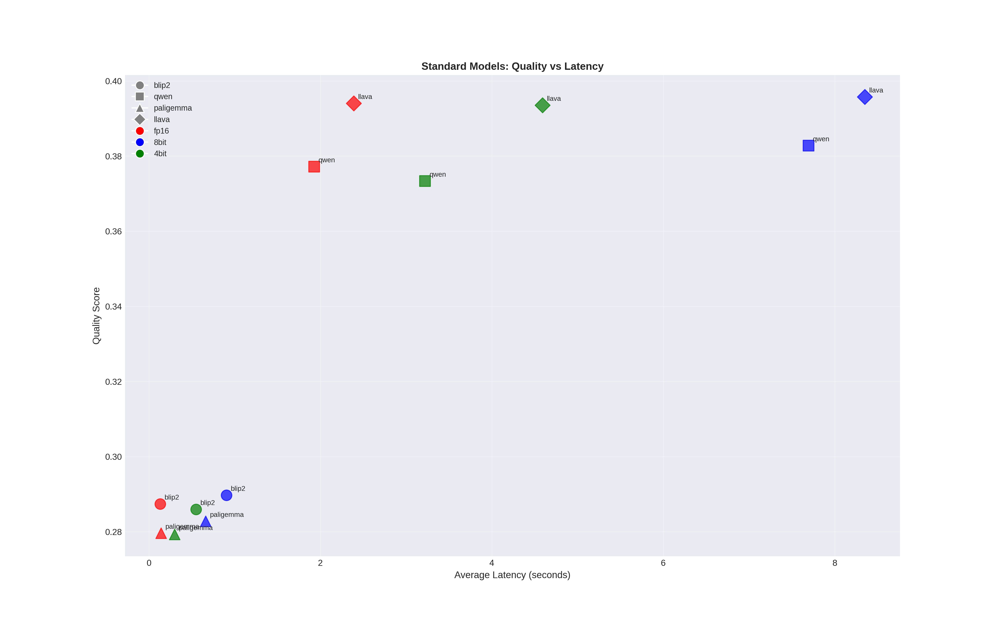
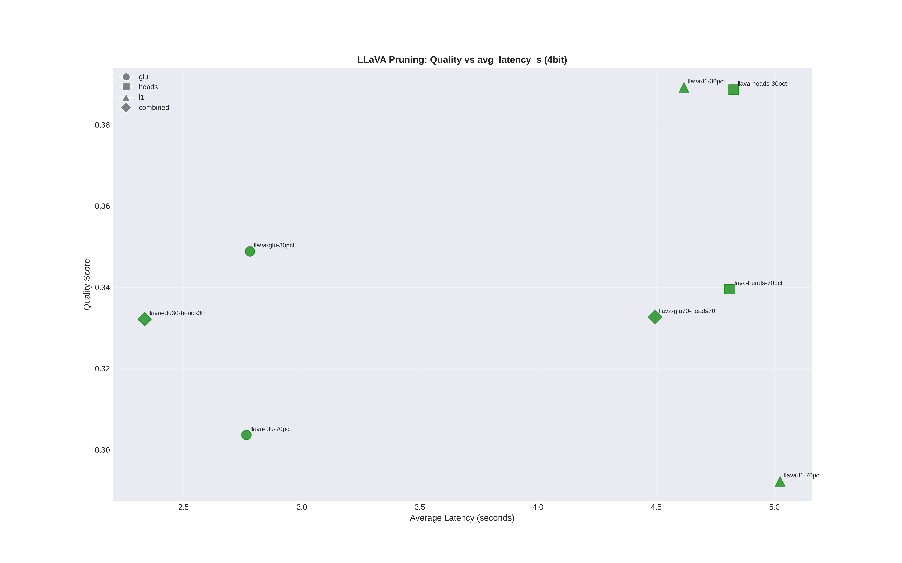
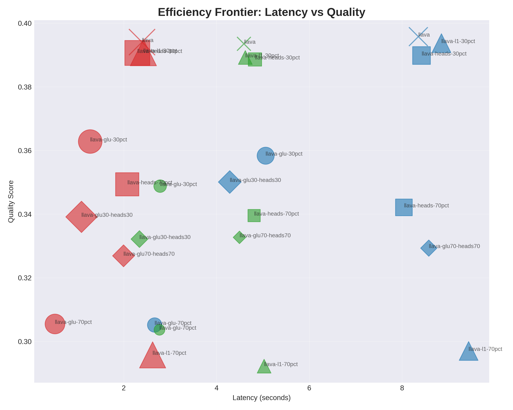

# VLM Optimization and Pruning Project

This project explores the optimization of Vision-Language Models (VLMs) through quantization and structural pruning, specifically focusing on LLaVA. It includes scripts for downloading datasets, pruning models, and benchmarking their performance.

**Read the full blog post about this project here:** [Optimizing VLMs for Production](https://khrtim.github.io//blog/2025/12/vqa-optimization/)

## Key Files

### 1. Dataset Setup
*   **`download_vqa_online_dataset.py`**: Downloads the VQAonline dataset from Hugging Face.
    ```bash
    python download_vqa_online_dataset.py
    ```
    *Note: Requires Hugging Face authentication.*

### 2. Model Pruning
*   **`model_pruning/create_pruned_models.py`**: The main script to generate pruned versions of LLaVA. It supports different pruning methods like GLU (MLP) pruning and Attention Head pruning.
    ```bash
    python model_pruning/create_pruned_models.py
    ```

    **Reference**: The GLU pruning implementation is based on the work by **Pere Martra**. You can read more about it in his blog post: [Making LLMs smaller without breaking them](https://huggingface.co/blog/oopere/making-llms-smaller-without-breaking-them).

### 3. Benchmarking
*   **`optimization_project/benchmark_models.py`**: (Formerly `bench_v2.py`) The core benchmarking script. It evaluates models on the VQA dataset, measuring latency, VRAM usage, and quality metrics (METEOR, ROUGE, BERTScore).
    ```bash
    python optimization_project/benchmark_models.py
    ```

## Results & Analysis

Here are some key findings from the benchmark:


### Standard Models Comparison
Baseline performance of standard models like BLIP-2, Qwen-VL, PaliGemma, and LLaVA.



### Pruning Impact (LLaVA)
How different pruning strategies (GLU vs Heads) affect performance, especially when combined with 4-bit quantization.





## Project Structure
- `data/`: Stores the downloaded VQA dataset.
- `pruned_models/`: Directory where pruned models are saved.
- `optimization_project/figures/`: Generated plots and visualizations from benchmark results.
